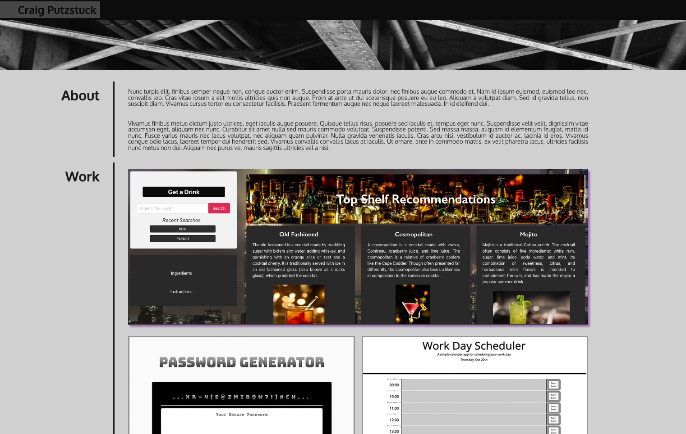

# PORTFOLIO

## Description

A clean and streamlined approach to showcasing my best and/or most recent projects.  This portfolio is built primarily on good ole fashioned CSS with a bit of jQuery sprinkled in.  It is meant to be a continuously updated webpage that will serve as a fantastic springboard into all things me!  Links to contact and socials help the user to get in touch.

## Installation

Installation is easy!  Simply copy and paste the following URL into your favorite browser:

https://argounova.github.io/initial-portfolio/

## Usage

Click on any of the project images to be taken to the live site or any of the links to get in contact with me.

## Credits

## License

N/A - Open Source